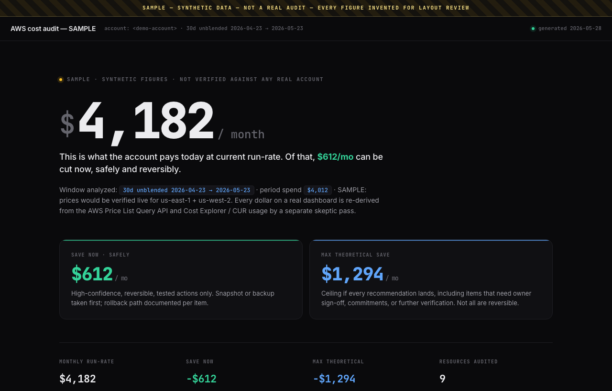

<p align="center">
  
</p>

<h1 align="center">AWS Cost Audit Skill</h1>

<p align="center">
  <strong>Ask Claude to audit your AWS bill. Get a clear savings plan where every number is checked against live AWS pricing, and nothing gets deleted without your say-so.</strong>
</p>

<p align="center">
  <a href="LICENSE"></a>
  
  
  <a href="CONTRIBUTING.md"></a>
  <a href="https://github.com/Aboudjem/10x"></a>
</p>

<p align="center">
  Part of the <a href="https://github.com/Aboudjem/10x"><b>10x</b> marketplace</a> — a curated set of Claude Code tools that ship quality.
</p>

---

## What is this?

It is a [Claude Code](https://www.claude.com/product/claude-code) skill that audits your AWS account for you.

You ask Claude something like *"audit my AWS bill"*. The skill reads your live account, works out what each thing costs and why, finds the waste, and hands you a plain-language report: what you pay today, what you can safely cut, and how sure it is about each one. It reads only by default. It never guesses a price, and it never deletes anything on its own.

Think of it as a careful FinOps engineer that shows its work.

**What is an AWS cost audit?** It is a structured review of an AWS account that finds what you are paying for, which resources are wasted or oversized, and what you can safely remove. This skill runs that audit for you and follows the [AWS Well-Architected Framework cost-optimization pillar](https://docs.aws.amazon.com/wellarchitected/latest/cost-optimization-pillar/welcome.html) and the [FinOps Foundation](https://www.finops.org/framework/) framework, so the method is not something it made up.

## Install

Pick whichever you prefer. All three install the same skill.

**From the [10x marketplace](https://github.com/Aboudjem/10x)** (recommended — it's curated there alongside other Claude Code tools):

```text
/plugin marketplace add Aboudjem/10x
/plugin install aws-cost-audit@10x
```

**From this repo directly:**

```text
/plugin marketplace add Aboudjem/aws-cost-audit-skill
/plugin install aws-cost-audit@aws-cost-audit-skill
```

**As a drop-in skill** (no plugin system):

```bash
git clone https://github.com/Aboudjem/aws-cost-audit-skill
cp -r aws-cost-audit-skill/skills/aws-cost-audit ~/.claude/skills/aws-cost-audit
```

You also need the [AWS CLI](https://aws.amazon.com/cli/) set up with read access to the account you want to audit. `ReadOnlyAccess` is enough for the audit itself.

## Use it in 3 steps

1. **Install it** (above).
2. **Ask Claude** to *"audit my AWS bill"* or *"find my unused AWS resources"*. The skill turns on by itself.
3. **Read the plan.** You get a report, and an optional HTML dashboard, showing cost, cause, and a confidence level for every saving.

That is the whole thing. Nothing is changed in your account unless you ask, and even then only after a safety check and your confirmation.

<p align="center">
  
</p>

## What you get

<p align="center">
  
  <br><sub>The optional dashboard (sample shown, synthetic data). Open <a href="examples/sample-dashboard.html"><code>examples/sample-dashboard.html</code></a> to see it live.</sub>
</p>

- **A spend breakdown.** What you pay today, per service and per region, pulled live from Cost Explorer.
- **A per-resource view.** For each resource: what it costs, what it does in plain words, who made it, when, and when it was last used. If a fact can't be verified, it says so instead of guessing.
- **A savings plan in two parts.** "Save now safely" (high-confidence, reversible, low-risk) kept separate from "maximum theoretical save" (the bigger cuts that need your sign-off).
- **An optional dashboard.** A single self-contained HTML page a non-technical person can read. See [`examples/sample-dashboard.html`](examples/sample-dashboard.html) and a [sample report](examples/sample-report.md).
- **Guardrails.** It checks whether you have budgets and cost-anomaly alerts, and helps you set them.

## Why you can trust the numbers

Most "cut your AWS bill" advice is generic, or it is a tool that quotes a price from memory. This skill is built around five rules it will not break:

1. **No made-up prices.** Every dollar comes from the live AWS price for *your* region plus your *actual* usage. It shows the unit price, the math, and the source. It hardcodes no prices anywhere.
2. **Attribute every dollar, or say "unknown."** It never invents an owner, a date, or a "last used."
3. **Nothing destructive without proof.** A change runs only if the resource is proven unused, the action is reversible, it passed a dry run, and the result is certain. Otherwise it stays a recommendation.
4. **One sample is never the whole fleet.** A separate skeptic pass re-derives the headline numbers from the source before they ship.
5. **Every finding shows its evidence.** Current cost, cost after, dollars saved, a confidence level, the proof, and how to undo it.

These rules exist because we watched agents *without* the skill break them. The recorded baseline is in [`docs/research/RED-baseline-findings.md`](docs/research/RED-baseline-findings.md): asked for the same savings number, two models confidently returned two different wrong figures from memory. The skill fixes that.

## How it compares

| | This skill | A manual audit | A cost SaaS dashboard |
|---|---|---|---|
| Runs against your live account | Yes | Yes | Yes |
| You can run it right now, for free | Yes | Yes | Usually paid / seat-based |
| Verifies each price live (no memorized rates) | Yes | Depends on the person | Shows its own figures |
| Attributes cost, owner, and last-used per resource | Yes | Slow, by hand | Partial |
| Can safely *act* on findings (gated + reversible) | Yes | Manual | Read-only |
| Generates a shareable report + dashboard | Yes | Manual | Yes |
| Sends your data to a third party | No | No | Often |
| Lock-in | None (MIT, your account) | None | Vendor |

## FAQ

**How do I audit my AWS bill with Claude?**
Install this skill, then ask Claude Code to "audit my AWS bill." It reads your account with the AWS CLI and produces an evidence-backed cost report and savings plan.

**Is it safe? Will it delete anything?**
It is read-only by default. It will not delete, stop, or change anything on its own. Any action is gated: the resource must be proven unused, the change must be reversible, it must pass a dry run, and you must confirm. Irreversible actions are always left as recommendations.

**Does it need my AWS keys?**
No. It uses your existing AWS CLI credentials on your own machine. Nothing is uploaded anywhere. `ReadOnlyAccess` is enough for the audit.

**Does it work on my account?**
Yes. It is generic. It reads whatever account your CLI is pointed at, across all regions, and ships with no account IDs, ARNs, or prices baked in.

**Does it hardcode AWS prices?**
No, on purpose. Prices change and vary by region, so it always fetches the live price for your region and combines it with your real usage.

**What does it cover?**
Idle and unattached resources, gp2→gp3, old snapshots and AMIs, NAT and data-transfer costs, idle load balancers, rightsizing, Savings Plans and Reserved Instance coverage, S3 lifecycle, CloudWatch log retention, cross-region leftovers, and missing budgets/alerts. The full list is in [the hunt list](skills/aws-cost-audit/references/hunt-list.md).

**Can I use it without the plugin system?**
Yes. Copy `skills/aws-cost-audit/` into `~/.claude/skills/aws-cost-audit/` and it works the same way.

## How it works under the hood

The skill is in [`skills/aws-cost-audit/SKILL.md`](skills/aws-cost-audit/SKILL.md). Heavier detail is loaded only when needed, from `references/`:

- [`hunt-list.md`](skills/aws-cost-audit/references/hunt-list.md): every high-ROI check, with the read-only command to detect it.
- [`pricing-verification.md`](skills/aws-cost-audit/references/pricing-verification.md): how it pulls a live, region-correct price and re-checks it.
- [`safety-and-gating.md`](skills/aws-cost-audit/references/safety-and-gating.md): the executor → verifier → rollback gate, and what may never run on its own.
- [`output-and-reporting.md`](skills/aws-cost-audit/references/output-and-reporting.md): the report shape and the per-finding contract.

Helper scripts in [`scripts/`](skills/aws-cost-audit/scripts) are dry-run by default. See the [quickstart](docs/quickstart.md) for a guided first run.

## Contributing

Issues and PRs are welcome. The one firm rule: this skill is built test-first, so a change that adds behavior needs the failing baseline it fixes. See [CONTRIBUTING.md](CONTRIBUTING.md) and the [Code of Conduct](CODE_OF_CONDUCT.md).

## License

[MIT](LICENSE). Use it, fork it, ship it.

---

<sub>Built and maintained by <a href="https://github.com/Aboudjem">Adam Boudjemaa</a>. Commands verified against AWS CLI v2 and the AWS docs in 2026. Spot a stale command or a gap? <a href="https://github.com/Aboudjem/aws-cost-audit-skill/issues">Open an issue</a>.</sub>
