<p align="center">
  <picture>
    <source media="(prefers-color-scheme: dark)" srcset="../assets/hero-dark.svg">
    <source media="(prefers-color-scheme: light)" srcset="../assets/hero-light.svg">
    
  </picture>
</p>

<h1 align="center">aws-cost-audit</h1>

<p align="center">
  <a href="../LICENSE"></a>
  <a href="https://github.com/Aboudjem/aws-cost-audit-skill/actions/workflows/validate.yml"></a>
  <a href="https://github.com/Aboudjem/aws-cost-audit-skill/stargazers"></a>
  <a href="https://github.com/Aboudjem/10x"></a>
</p>

<p align="center">
  <a href="../README.md">English</a> · <a href="zh-CN.md">简体中文</a> · <a href="ja.md">日本語</a> · <b>Español</b> · <a href="fr.md">Français</a>
</p>

<p align="center">
  <strong>Pide a Claude que audite tu factura de AWS. Cada cifra se comprueba contra los precios en vivo de AWS.</strong>
</p>

<p align="center">
  <a href="#qué-hace">Qué hace</a> · <a href="#instalación">Instalación</a> · <a href="#cómo-usarlo">Cómo usarlo</a> · <a href="#qué-obtienes">Qué obtienes</a> · <a href="#funciona-en-tu-editor">Funciona en tu editor</a> · <a href="#conviene-saber">Conviene saber</a>
</p>


<p align="center"><sub>Todas las cifras de la grabación son <b>ilustrativas</b>: datos sintéticos, ninguna cuenta real.</sub></p>

```bash
claude plugin marketplace add Aboudjem/10x
claude plugin install aws-cost-audit@10x
```

## Qué hace

Es una skill para [Claude Code](https://www.claude.com/product/claude-code): un archivo Markdown de instrucciones, seis documentos de referencia que solo se cargan cuando hacen falta y diez scripts de bash. Claude la recoge cuando le preguntas por tu gasto en AWS.

Le dices "audita mi factura de AWS". Lee tu cuenta con la AWS CLI que ya tienes, calcula cuánto cuesta cada recurso y por qué, y te entrega un plan. Por defecto solo lee. Nunca cita un precio de memoria y nunca borra nada por su cuenta.

- **Un desglose del gasto.** Lo que pagas por servicio y por región, tomado en vivo de Cost Explorer.
- **Una vista por recurso.** Cuánto cuesta cada cosa, qué hace en lenguaje llano, quién la creó y cuándo se usó por última vez. Si un dato no se puede verificar, lo dice en lugar de suponerlo.
- **Un plan de ahorro en dos mitades.** "Ahorra ya, sin riesgo" (reversible, alta confianza) separado del "ahorro teórico máximo", que necesita tu aprobación.

El método sigue el [pilar de optimización de costes de AWS Well-Architected](https://docs.aws.amazon.com/wellarchitected/latest/cost-optimization-pillar/welcome.html) y el marco de la [FinOps Foundation](https://www.finops.org/framework/), así que no es algo que la skill se haya inventado.

## Instalación

Dentro de Claude Code, desde el [marketplace 10x](https://github.com/Aboudjem/10x):

```bash
claude plugin marketplace add Aboudjem/10x
claude plugin install aws-cost-audit@10x
```

En cualquier otro agente, mediante la [CLI de skills de Vercel](https://github.com/vercel-labs/skills):

```bash
npx skills add Aboudjem/aws-cost-audit-skill
```

También necesitas la [AWS CLI](https://aws.amazon.com/cli/) configurada con acceso de lectura a la cuenta que quieras auditar. La política gestionada `ReadOnlyAccess` de AWS más lectura de facturación basta para la auditoría en sí.

<details>
<summary>Copiar la skill a mano en su lugar</summary>

Sáltate el sistema de plugins por completo. La skill es un directorio de Markdown y scripts de shell, así que basta con copiarla a un directorio que tu agente lea:

```bash
git clone https://github.com/Aboudjem/aws-cost-audit-skill
mkdir -p ~/.claude/skills
cp -r aws-cost-audit-skill/skills/aws-cost-audit ~/.claude/skills/aws-cost-audit
```

Este repositorio no lleva manifiesto de marketplace propio, así que `claude plugin marketplace add Aboudjem/aws-cost-audit-skill` no resolverá nada. La vía de plugin es el marketplace 10x de arriba. Windows y las rutas de cada editor están en [docs/editors.md](../docs/editors.md).
</details>

## Cómo usarlo

**1. Comprueba el entorno.** `doctor.sh` nombra lo que falta antes de empezar una auditoría. No hace ninguna llamada a AWS que cambie algo, no tiene flag de aplicación y borra el archivo de sondeo que escribe:

```bash
bash skills/aws-cost-audit/scripts/doctor.sh --offline
```

```text
aws-cost-audit doctor

[OK]   aws CLI found: aws-cli/2.33.9 Python/3.13.12 Darwin/25.3.0 source/arm64
[SKIP] caller identity (--offline)
[OK]   jq found: jq-1.7.1-apple
[OK]   region resolves to ap-southeast-1
[OK]   output directory writable: ./cost-audit-out
[SKIP] Cost Explorer probe (opt in with --check-cost-explorer; the request is billed)

No blockers. This environment can run an audit.
```

**2. Pídeselo a Claude.** Di `audit my AWS bill`, o `find my unused AWS resources`. La skill está escrita para activarse con ese fraseo. Si tienes más de una cuenta, dile qué perfil y qué regiones mirar.

**3. Lee el plan.** Obtienes un informe y, si lo quieres, un panel HTML. Nada cambia en tu cuenta salvo que lo pidas, y aun así solo tras un ensayo en seco y tu confirmación.

<p align="center">
  
</p>

El recorrido completo, de las credenciales al panel, está en la [guía rápida](../docs/quickstart.md).

## Qué obtienes

- **Un informe.** Cada hallazgo se lee como `current $/mo -> after $/mo -> $ saved`, con la evidencia, un nivel de confianza y cómo deshacerlo. Mira [`examples/sample-report.md`](../examples/sample-report.md).
- **Un panel, si lo quieres.** Un único archivo HTML que puede abrir alguien sin perfil técnico. Toma su tipografía y su librería de gráficos de un CDN, así que se ve bien en una máquina con red. Mira [`examples/sample-dashboard.html`](../examples/sample-dashboard.html).
- **Un `findings.json` legible por máquina, si lo pides.** Lo comprueba `findings-validate.sh` contra un contrato estructural fijo, que es lo que permite comparar dos auditorías en vez de releerlas.
- **Un precio en vivo para cada cifra.** Precio unitario, la cuenta y la fuente, consultados para tu región. La Price List Query API es la primera parada; lo que no se pueda verificar se queda marcado como desconocido.
- **Barreras de seguridad.** Informa de si tienes presupuestos y alertas de anomalías de coste, y te ayuda a configurarlos.

## Funciona en tu editor

| Agente | Instalación en una línea |
|:--|:--|
| Claude Code | `claude plugin install aws-cost-audit@10x` |
| Cualquiera de otros 70+ agentes | `npx skills add Aboudjem/aws-cost-audit-skill` |
| Codex, Gemini CLI, OpenCode, Pi | `./install.sh codex` (o `gemini`, `opencode`, `pi`) |
| VS Code con Copilot | `./install.sh copilot` |
| Todo lo demás | mira [docs/editors.md](../docs/editors.md) |

Funciona en Claude Code, Cursor, Codex, Copilot, Gemini CLI y otros 70+ agentes a través de `npx skills add`. `install.sh` es el envoltorio de los trece identificadores de editor que este repositorio ha soportado siempre, y ahora delega en esa misma CLI:

```bash
curl -fsSL https://raw.githubusercontent.com/Aboudjem/aws-cost-audit-skill/main/install.sh | bash -s codex
```

Este plugin no incluye servidor MCP, a propósito. Invoca la AWS CLI que ya tienes, así que no hay un proceso extra que ejecutar ni nada que añadir a un `.mcp.json`.

## Conviene saber

> [!IMPORTANT]
> Por defecto solo lee. No borra, detiene ni cambia nada por su cuenta. Toda acción pasa por una puerta: hay que probar que el recurso no se usa, el cambio debe ser reversible, debe superar un ensayo en seco y tú debes confirmarlo. Las acciones irreversibles se quedan siempre en recomendaciones.

- **Ningún precio de memoria.** Cada cifra sale del precio en vivo de AWS para tu región multiplicado por tu uso real. Ningún precio de recurso se escribe en un script ni en un hallazgo, y la CI hace fallar la compilación si aparece uno. El único precio que este repositorio registra es el cargo por petición de la propia API de Cost Explorer, que es lo que cuesta ejecutar la auditoría, no el precio de nada de lo que informa. Está en un documento de referencia junto con su fuente de AWS.
- **Las peticiones a Cost Explorer se cuentan y se limitan.** Los scripts encaminan sus peticiones por un único envoltorio que cuenta cada página y rechaza la que supere `AWS_COST_AUDIT_CE_BUDGET`. Una llamada `aws ce` que hagas tú por tu cuenta queda fuera de ese recuento.
- **Habla con AWS y con nadie más.** Usa en local las credenciales de AWS CLI que ya tienes, no te pide claves y no envía tu auditoría a ningún tercero. Los scripts necesitan bash y la AWS CLI; `findings-validate.sh` necesita además `jq`.

## Más información

- [Guía rápida](../docs/quickstart.md): requisitos, instalación y qué hace paso a paso una ejecución completa.
- [Soporte de editores y agentes](../docs/editors.md): una línea por agente, más la vía de copia manual.
- [Preguntas frecuentes](../docs/faq.md): qué cubre, cuánto cuesta ejecutarlo, qué no toca.
- [Cómo se compara](../docs/comparison.md): frente a una auditoría manual y frente a un panel de costes.
- [La skill en sí](../skills/aws-cost-audit/SKILL.md): las cinco leyes de hierro, el flujo de trabajo y los documentos de referencia que carga bajo demanda.
- [CHANGELOG](../CHANGELOG.md) · [CONTRIBUTING](../CONTRIBUTING.md) · [Licencia MIT](../LICENSE)

---

<sub>Creado y mantenido por <a href="https://github.com/Aboudjem">Adam Boudjemaa</a>. Los comandos están escritos para AWS CLI v2. ¿Ves un comando obsoleto o una carencia? <a href="https://github.com/Aboudjem/aws-cost-audit-skill/issues">Abre una incidencia</a>.</sub>

<sub>Este documento se ha traducido con ayuda automática. Si hay discrepancias, la versión en inglés prevalece.</sub>
