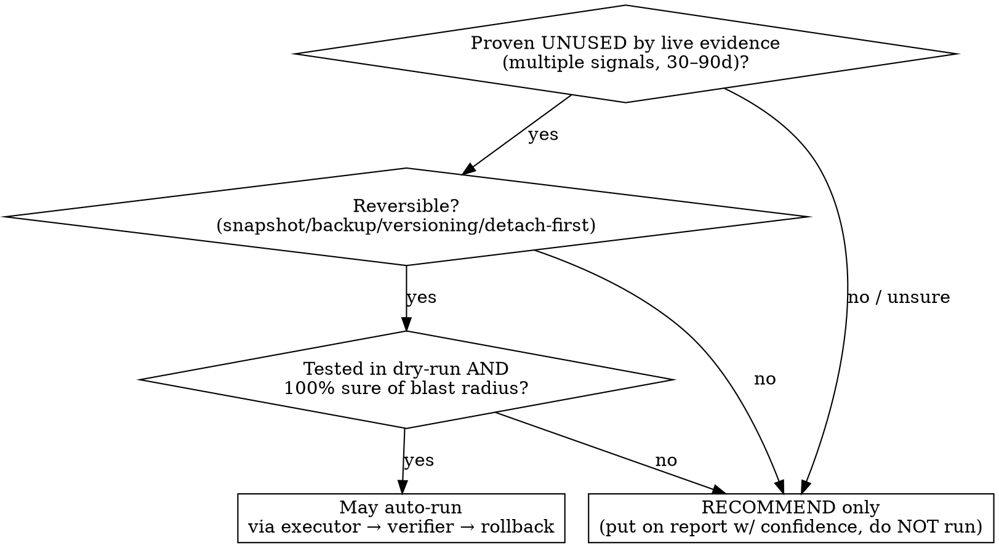

# AWS Cost Audit

## Overview

Audit a **live AWS account** the way a careful FinOps engineer would: attribute every
dollar, find waste, and produce an **evidence-backed savings plan** with confidence levels and
**reversible, gated actions** — for *anyone's* account, with **zero hardcoded prices** and zero
secrets.

**Core principle:** every number is verified against a primary source before it is stated, and
nothing destructive runs unless it is proven-unused, reversible, tested, and certain. A claim you
did not verify is not a finding — it is a guess, and guesses do not ship.

This skill targets **Claude Code** (it shells out to the AWS CLI). Work **read-only by default**;
treat any change as gated (see below).

## The Iron Laws (non-negotiable)

These five laws exist because, without them, agents reliably fail in specific ways (see
`references/why-these-laws.md` for the recorded baseline). Violating the letter of a law violates
its spirit — do not look for loopholes.

1. **No unverified price. Ever.** Never state a unit price, a monthly cost, or a "$X saved" figure
   from memory. Every dollar figure must come from BOTH (a) the **live unit price** for the user's
   exact Region (AWS Price List Query API or the service's pricing page) and (b) the user's **actual
   usage** (Cost Explorer / CUR). Always show: `unit price → math → source`. **Never hardcode a
   price in this skill, a script, or a report.** Prices change and are Region-specific; memorized
   prices are how two runs produce two different wrong numbers.

2. **Attribute every dollar, or say "unknown."** For each resource state cost · plain-language
   purpose · owning app/repo · creator (CloudTrail) · created-when · last-used (CloudWatch / access
   logs / last-invocation). If any cannot be determined, write **"unknown — could not verify"**.
   Never invent an owner, a date, or a last-used.

3. **Nothing destructive unless proven-unused + reversible + tested + 100% sure.** Otherwise it is a
   **recommendation**, not an action. See the decision flow below and `references/safety-and-gating.md`.

4. **No single probe becomes a fleet-wide fact.** Fan out checks across resources/Regions. A
   **separate** skeptic pass must re-derive every load-bearing claim (headline savings, each
   "safe-to-delete" verdict) from the **primary source**, not from another agent's summary.

5. **Every finding carries its evidence.** Output contract per item: `current $/mo → after $/mo →
   $ saved → confidence (High/Med/Low) + evidence + reversibility`. Split the total into **"save now
   safely"** (High-confidence, reversible, tested) vs **"max theoretical save"**. See
   `references/output-and-reporting.md`.

## Workflow

Run the steps in order. Heavy detail lives in `references/` — load a reference only when you reach
its step (token-efficient progressive disclosure).

1. **Re-baseline live.** Confirm identity (`aws sts get-caller-identity`), then pull Cost Explorer:
   total + by-service + by-Region + by-usage-type + daily + 90-day trend + forecast. State today's
   spend, reconciled to the dollar. Save raw JSON.
2. **Inventory every Region and service.** Loop `aws ec2 describe-regions` and sweep each service.
   Work the **hunt list** in `references/hunt-list.md` (the high-ROI checks, each with a verified
   detection command). Run the managed detectors first — **Cost Optimization Hub**, **Compute
   Optimizer**, **Trusted Advisor** — they pre-compute most findings and net out existing commitments.
3. **Classify** each resource **KEEP / OPTIMIZE / SAFE-TO-DELETE**, and justify every dollar.
4. **Build the savings model** using the output contract (Law 5). Per item: current → after, $ saved,
   confidence + evidence + reversibility.
5. **Verify prices live + skeptic pass.** Every dollar figure is re-derived from the live price
   source and actual usage by a *separate* check (Law 1 + Law 4). See `references/pricing-verification.md`.
6. **Gated remediation.** Only High-confidence, reversible, tested, certain items may auto-run, and
   only with the executor → verifier → rollback gate. Everything else is a labeled recommendation.
7. **Deliver.** A plain-language report (`references/output-and-reporting.md`), an optional generated
   HTML dashboard (`references/dashboard.md` + `assets/dashboard-template.html`), a health/monitoring
   view, and budget + anomaly-detection guardrails. Finish with a **completeness pass**: "what Region
   / service / cost driver did we NOT inspect?" — it must come back empty.

## Decision: auto-execute vs recommend

The only non-obvious call in this skill. When in doubt, recommend.



Irreversible actions (release EIP, delete snapshot/AMI, terminate, Savings Plan/RI purchase) are
**never** auto-run — they are always recommendations requiring explicit human sign-off.

## Quick reference — highest-ROI checks

Full hunt list with verified commands, reversibility, and price source: `references/hunt-list.md`.

| Check | Detect (read-only) | Reversibility |
|---|---|---|
| Unassociated Elastic IPs | `aws ec2 describe-addresses` (no `AssociationId`) | Destructive — lose the IP |
| Unattached EBS volumes | `aws ec2 describe-volumes --filters Name=status,Values=available` | Snapshot first |
| gp2 → gp3 | `describe-volumes --filters Name=volume-type,Values=gp2` | Low risk, reversible |
| Old snapshots / AMIs | `describe-snapshots --owner-ids self`; `describe-images --owners self` | Destructive |
| NAT data-processing | `describe-nat-gateways` + CloudWatch bytes; CE by usage-type | Routing change |
| Idle ALB/NLB, empty TGs | `elbv2 describe-load-balancers` + `describe-target-health` | Destructive |
| Rightsizing | `compute-optimizer get-*-recommendations` | Restart window |
| Savings Plans / RI gaps | `ce get-savings-plans-coverage` / `-utilization` | Commitment — irreversible |
| S3 lifecycle / MPU | `s3api get-bucket-lifecycle-configuration`, `list-multipart-uploads` | Expiry is destructive |
| CloudWatch retention | `aws logs describe-log-groups` (absent `retentionInDays` = never) | Set is reversible |
| Cross-Region ghosts | loop the above over `describe-regions` | Per-resource |
| Guardrails missing | `ce get-anomaly-monitors`, `budgets describe-budgets` | No risk |

## One worked example — an unattached EBS volume

This shows the full method on a single finding. Apply the same shape to every item.

```bash
# 1. DETECT (read-only)
aws ec2 describe-volumes --region "$REGION" \
  --filters Name=status,Values=available \
  --query 'Volumes[].{id:VolumeId,gb:Size,type:VolumeType,created:CreateTime,az:AvailabilityZone}'

# 2. ATTRIBUTE — never guess; "unknown" is a valid answer
aws ec2 describe-volumes --volume-ids "$VOL" --query 'Volumes[0].Tags'        # owner/app? else unknown
aws cloudtrail lookup-events --lookup-attributes \
  AttributeKey=ResourceName,AttributeValue="$VOL" \
  --query 'Events[?contains(EventName,`CreateVolume`)].[Username,EventTime]'  # creator/when, or "unknown — predates trail"
aws cloudwatch get-metric-statistics --namespace AWS/EBS --metric-name VolumeReadOps \
  --dimensions Name=VolumeId,Value="$VOL" --start-time "$START" --end-time "$NOW" \
  --period 86400 --statistics Sum --region "$REGION"                          # last-used signal

# 3. VERIFY PRICE LIVE (never from memory) — gp3 storage $/GB-month for THIS region
aws pricing get-products --service-code AmazonEC2 --region us-east-1 \
  --filters "Type=TERM_MATCH,Field=productFamily,Value=Storage" \
            "Type=TERM_MATCH,Field=volumeApiName,Value=gp3" \
            "Type=TERM_MATCH,Field=regionCode,Value=$REGION" \
  --query 'PriceList' --output text     # parse the returned JSON for the per-GB-mo USD rate
# savings $/mo = (live $/GB-mo) × (provisioned GB).  Show the math and the source.
```

**Finding (the shape every item takes):**
- **What / purpose:** 100 GB gp3 volume, `available` (detached). Tags: none → **owner unknown**.
- **Creator / created / last-used:** `CreateVolume` by `unknown — predates CloudTrail window`;
  created `<date>`; `VolumeReadOps = 0` for 90 days → **strong unused signal**.
- **Cost now → after:** `(live gp3 $/GB-mo from Price List API) × 100` → `$0`.
- **$ saved:** that figure. **Confidence: High** — zero I/O 90d, detached, no references.
  **Evidence:** the three commands above. **Reversibility:** snapshot first, then delete (recoverable).
- **Verdict:** SAFE-TO-DELETE *as a recommendation*; auto-run only after snapshot + dry-run + sign-off.

## Rationalization table — STOP if you catch yourself thinking this

| Rationalization | Reality |
|---|---|
| "I know AWS prices, gp3 is ~$0.08/GB." | Prices are Region-specific and change. Memorized → wrong. Query the live Price List API for *their* Region. |
| "Just give them the number for the slide." | A wrong number on a slide is worse than 'pending live verification'. Verify, then state, with the math. |
| "It looks idle/unattached, I'll just delete it." | "Looks" is not "proven." Prove unused via multiple signals over 30–90d, snapshot, dry-run, sign-off. |
| "One service was at 4% CPU, so the fleet is over-provisioned." | One sample is not the fleet. Use Compute Optimizer + p99/max per resource. |
| "I'll estimate the owner from the name." | Estimating attribution is guessing. Write "unknown — could not verify." |
| "RDS backup is free, deleting saves nothing — skip it." | Maybe. Confirm against CUR/Cost Explorer whether it is actually billed before claiming $0 *or* savings. |
| "Container Insights / logs are cheap." | They are a top-5 line item in many accounts. Check Cost Explorer by usage-type. |
| "It's reversible, so I can run it now." | Reversible is necessary, not sufficient. Also needs proven-unused + tested + 100% sure + (for irreversible) sign-off. |

## Red flags — these mean STOP and re-read the Iron Laws

- A dollar figure in your answer that you did not pull from the live price source + actual usage.
- A `delete`/`terminate`/`release`/`rm` you are about to run without a snapshot/rollback and sign-off.
- An owner, creation date, or "last used" you inferred rather than read from an API.
- A fleet-wide conclusion drawn from one resource.
- A headline savings total that no separate skeptic pass re-derived from primaries.

## Reference files (load on demand)

- `references/hunt-list.md` — every high-ROI check: verified detection command, why it saves, reversibility, where to verify the price.
- `references/pricing-verification.md` — how to get a live, Region-correct price and reconcile it with actual usage; the skeptic re-derivation routine.
- `references/safety-and-gating.md` — the executor → verifier → rollback pattern; reversibility techniques; what may never auto-run.
- `references/output-and-reporting.md` — the per-item output contract, the report structure, "save now" vs "max theoretical".
- `references/dashboard.md` — how to generate the optional HTML dashboard from verified data (template in `assets/`).
- `references/why-these-laws.md` — the recorded baseline failures the Iron Laws fix (the TDD evidence).
- `scripts/` — generic, parameterized, dry-run-by-default helpers (no hardcoded account/ARN/price).
